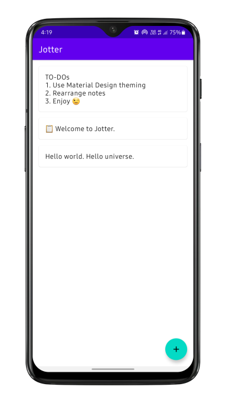
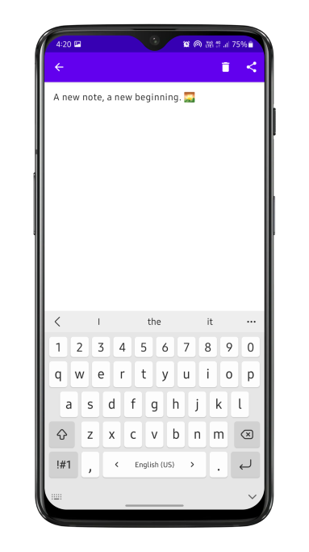
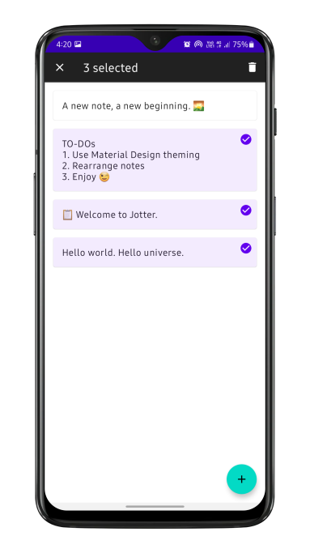

# Jotter

Jot down your notes using Jotter. Made with ❤️ in Kotlin.

Aimed to use the latest architecture practices like:
- Kotlin Coroutines
- Room
- Architecture Components (LiveData)
- and, Material Design as well.

## Current Status

The architecture is kind of messy with some work remaining in the **UI Layer**. But the following basic functionalities work:

- Add, delete and edit notes
- Share a note's textual content
- Persist notes in a local database

## Screenshots

